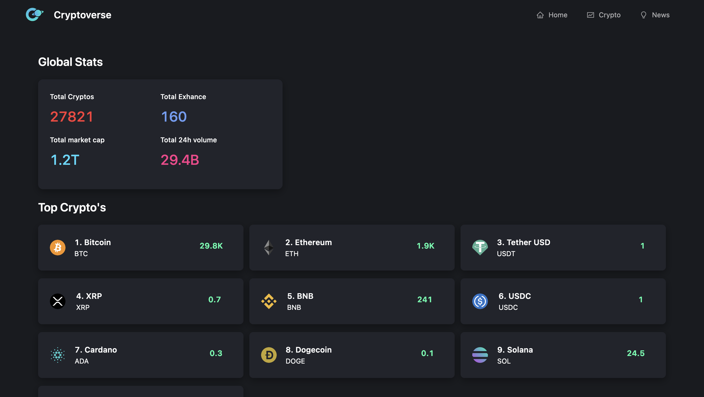
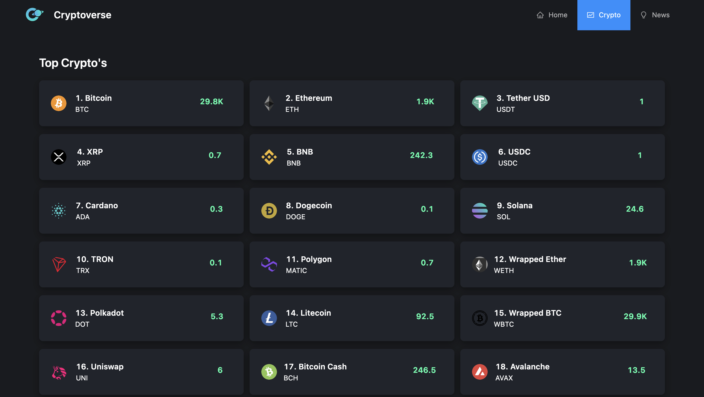

# Cryptoverse

Cryptoverse is a Next.js web application that provides real-time information about the top cryptocurrencies and up-to-date news from the world of cryptocurrencies. Whether you are a seasoned crypto enthusiast or just starting your journey into the exciting world of digital currencies, Cryptoverse offers a user-friendly interface to keep you informed.

Check out the live application: [Here](https://cryptoverse-ui.vercel.app/)

## Tech Stack

- Next.js
- TypeScript
- Ant Design

## Features

- Real-time data: Cryptoverse leverages the CoinRanking API to display the latest information about the top cryptocurrencies, ensuring that you always have up-to-date data at your fingertips.

- Crypto Currencies News: Stay informed about the latest developments and news in the cryptocurrency space with the Bing Search API integration, which provides real-time news related to cryptocurrencies.

## Screenshots

## Installation and Usage

1. Clone the repository: `git clone https://github.com/your-username/cryptoverse.git`
2. Navigate to the project directory: `cd cryptoverse`
3. Install the dependencies: `npm install`
4. Run the development server: `npm run dev`
5. Open your web browser and visit: `http://localhost:3000`

## Contribution

Contributions to Cryptoverse are welcome and encouraged. If you find a bug or want to add a new feature, please open an issue or submit a pull request.
